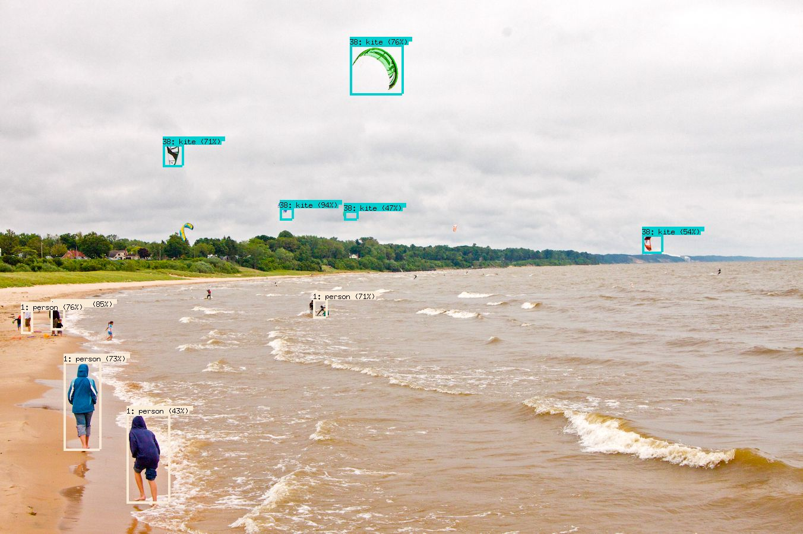

# gococo
Go CLI for using COCO object recognition models.

## Installing

Before you begin, you'll of course need the Go programming language installed. You can of course download [ActiveGo](https://www.activestate.com/activego/downloads) for your preferred platform.

1. Clone this repo.
2. Run `dep ensure`
3. Build the application with `go build`.
2. Download one of the COCO models from the [TensorFlow model zoo](https://github.com/tensorflow/models/blob/477ed41e7e4e8a8443bc633846eb01e2182dc68a/object_detection/g3doc/detection_model_zoo.md).
3. Run the program according the usage below.

## Usage

`gococo -dir=<model folder> -jpg=<input.jpg> [-out=<output.jpg>] [-labels=<labels.txt>]`

## Using Pre-Trained Models with TensorFlow in Go

One of the challenges with machine learning is figuring out how to deploy trained models into production environments. After training your model, you can 'freeze' the weights in place and export it to be used in a production environment, potentially deployed to any number of server instances depending on your application.

For many common use cases, we're beginning to see organizations sharing their trained models in ready-to-use forms - and there are already a number of the most common models available for use in the TensorFlow [model repo](https://github.com/tensorflow/models).

For many building large scale web services, Go has become a language of choice. Go also has a growing data science community, but some of the tools are still missing documentation or features when compared to other languages like Python.

In this post, we'll explore how to take one of the pre-trained models for TensorFlow and set it up to be executed in Go. The specific use case we’ll be exploring is detecting multiple objects within any image -- something that machine learning has gotten very good at. In this case, we'll use the newly released TensorFlow Object Detection model, which is trained on the [COCO](http://mscoco.org) (Common Objects in Context) dataset.

We'll build a small command line application that takes any JPG image as input and outputs another image that has identified objects labelled in the image. You can find all of the code from this post and the full application in the [following repo](https://github.com/ActiveState/gococo).

One of the first places to start is by looking at the [example application](https://github.com/tensorflow/tensorflow/blob/master/tensorflow/go/example_inception_inference_test.go) included in the Go TensorFlow binding, which uses the Inception model to do object identification - without extensive documentation, this example can give us valuable clues into how to use the bindings with the other pre-trained models, which are similar but not exactly the same.

For ours, we'll use the multi-object detection model trained on the COCO dataset. You can find that model on [GitHub](https://github.com/tensorflow/models/blob/477ed41e7e4e8a8443bc633846eb01e2182dc68a/object_detection/g3doc/detection_model_zoo.md). You can choose any of the models to download. We’ll trade off a bit of accuracy for speed and use the mobile one [ssd_mobilenet_v1_coco](http://download.tensorflow.org/models/object_detection/ssd_mobilenet_v1_coco_11_06_2017.tar.gz).

After extracting the model, the first step in our program is to load the frozen graph so that we can use it to identify our image.

```Go
    // Load a frozen graph to use for queries
    modelpath := filepath.Join(*modeldir, "frozen_inference_graph.pb")
    model, err := ioutil.ReadFile(modelpath)
    if err != nil {
        log.Fatal(err)
    }

    // Construct an in-memory graph from the serialized form.
    graph := tf.NewGraph()
    if err := graph.Import(model, ""); err != nil {
        log.Fatal(err)
    }

    // Create a session for inference over graph.
    session, err := tf.NewSession(graph, nil)
    if err != nil {
        log.Fatal(err)
    }
    defer session.Close()
```

Thankfully, as you can see, we can just feed the protocol buffer file to the `NewGraph` function and it will decode it and build the graph. Then we just set up a session using this graph, and we can move on to the next step.

If you read my [recent post](http://gopherdata.io/post/build_ml_powered_game_ai_tensorflow/) summarizing my talk from GopherCon, you saw that I used `LoadSavedModel` to load a model that we trained in Python and saved out to use in Go. In this case, we can't use `LoadSavedModel`, but must load the graph directly as we see above.

Now that we have a graph, how do we use it to identify images? What are the input and output nodes of this graph? What shape does our input data need to be in?

Unfortunately none of these questions have easy or well-documented answers!

### Step 1: Identify the input and output nodes of the graph

For my [GopherCon demo](https://www.youtube.com/watch?v=oiorteQg9n0), I joked that I looked through the protocol buffer directly to find the names of the TensorFlow nodes for my model, and that if you were smart, you might print out the names from Python before you exported it, or dump them to a file on disk. 

Shockingly, this is still one possibly effective strategy here. Combined with some Googling around the subject, digging through source code, you will find that the nodes for this model are as follows:

| Node Name         | Input/Output | Shape     | Data Description                                                                                         |
|-------------------|--------------|-----------|----------------------------------------------------------------------------------------------------------|
| image_tensor      | Input        | [1,?,?,3] | RGB pixel values as uint8 in a square format (Width, Height). The first column represent the batch size. |
| detection_boxes   | Output       | [?][4]    | Array of boxes for each detected object in the format [yMin, xMin, yMax, xMax]                           |
| detection_scores  | Output       | [?]       | Array of probability scores for each detected object between 0..1                                        |
| detection_classes | Output       | [?]       | Array of object class indices for each object detected based on COCO objects                             |
| num_detections    | Output       | [1]       | Number of detections                                                                                     | 

I would suggest that it would be best practice when publishing models to include this information as part of the documentation. Once you get the names of the nodes associated with the input/output, you can use the `Shape` method to display the shape of these inputs. In our case the input shape is similar to the one used in the Inception example referred to earlier.

From here, we can now work towards loading our image and transforming it into a format that we can use in our graph.

### Step 2: Load the image and transform it into a tensor

The next thing we need to do is load the image provided as a command-line argument and turn it into a tensor. There are a number of ways to do this, but one way that Google used in the Inception example is actually super-cool and so I'm going to use a simplified version of that here just to demonstrate that you can do this - I didn't realize you could, so maybe some of you don't either!

So, after loading the JPG file, what we can do is construct a TensorFlow graph to decode this and output a Tensor to feed into the detection graph. Cool! Remember that technically speaking, TensorFlow is a general purpose computation graph library, and so there is actually a pretty wide-array of functionality that it can perform and in the case where we are trying to transform data to use with TensorFlow, it sort of makes sense to use it to help us do that.

```Go
func decodeJpegGraph() (graph *tf.Graph, input, output tf.Output, err error) {
    s := op.NewScope()
    input = op.Placeholder(s, tf.String)
    output = op.ExpandDims(s,
        op.DecodeJpeg(s, input, op.DecodeJpegChannels(3)),
        op.Const(s.SubScope("make_batch"), int32(0)))
    graph, err = s.Finalize()
    return graph, input, output, err
}
```

Really, the only thing this graph does is decode a JPG, but something that is slick is that if you recall, our input needs to be in the form: [1,?,?,3] and we need to add an additional column to indicate the size of the batch. In our case, because it's a single image, we're just adding an extra 0 there, but the `ExpandDims` operation makes manipulating our JPG data pretty simple.

We're returning the input and output nodes of this graph as return values in this function, and can then just run a session on this graph with the JPG data on the input, and the output of this graph will be the Tensor that we can use in the COCO detection graph that does the real work.

### Step 3: Execute the COCO Graph to identify objects

We've now got our image transformed into a tensor, and we've identified all of our input and output nodes on the COCO graph. Now, if we execute that graph in a session, we'll get back a list of probabilities of objects detected in the image:

```Go
    output, err := session.Run(
        map[tf.Output]*tf.Tensor{
            inputop.Output(0): tensor,
        },
        []tf.Output{
            o1.Output(0),
            o2.Output(0),
            o3.Output(0),
            o4.Output(0),
        },
        nil)
```

The variable `tensor` above is the output from the previous `DecodeJpeg` graph we constructed. The list of outputs (`o1,o2,o3,o4`) are the various outputs outlined in the table above. And at this stage we can parse the results of the output.

There are a couple of notes to keep in mind when parsing the results:

- You probably want to set a threshold below which you want to ignore the results since the algorithm will try to detect things even with very low probability. I filtered out everything below around 40% confidence.
- The `detection_scores` list is sorted by probability, and each corresponding array is also identically sorted. So, for example, index 0 will have the highest probability object detected. And `detection_boxes` will contain the coordinates of its bounding box, and `detection_classes` will contain the class label for the object (ie. the name of the object: 'dog', 'person', etc.).
- The box coordinates are normalized, so you need to make sure you cache the width and height of the original JPG if you want to translate them into pixel coordinates in the image.

### Step 4: Visualizing the output

Printing out a list of probabilities, class indices and box dimensions isn't really that interesting so we'll also extend our little CLI to output a version of the image with the results of the model rendered into it. Like many of the existing examples, we'll draw bounding boxes and label them with the confidence percentage. 

We're just going to use the built-in `image` package to do some basic rendering, as well as the built-in font for rendering the labels.

The labels found in the TensorFlow repo actually seem to be out-of-date with the model since I was able to detect objects that were not present in the labels file, as a result I am using (and including) an extended list of COCO objects from the [COCO Stuff](https://github.com/nightrome/cocostuff) repo in an easy one-per-line format here.

With labels loaded into a simple array, and armed with the tools in Go's standard library for image processing we can fairly easily iterate through the results and output an image with each object identified. We'll use the standard beach and kite image that Google used in its example:



### Wrap-up

And that's it! We've now got a small Go program that can take any image and identify it using the popular COCO TensorFlow models supplied by Google. I have posted all of the code for this program, including all of the snippets from this post on GitHub in the [gococo](https://github.com/ActiveState/gococo) repo.

It's clear that there is still a lot of work to be done around documenting both the "APIs" of these models but also the best practices for how to work with them. However, operationalizing machine-learning algorithms is becoming a much more common use case and with the widespread use of Go in server apps, having good tools and information about how to work with these models is critical.

---
If you want to get started doing data science and machine learning with Go, [download ActiveGo](https://www.activestate.com/activego/downloads) which comes pre-bundled with a number of key data-science packages, including the TensorFlow binding for Go. It also includes packages for microservices, web development and more. Give it a shot to get your ML development environment up and running fast.

*Further Reading*
[Building an ML Powered AI using TensorFlow in Go](http://gopherdata.io/post/build_ml_powered_game_ai_tensorflow/)

## Author

Written by Pete Garcin [Twitter](https://twitter.com/rawktron) [GitHub](https://github.com/rawktron)

## License

Copyright (c) 2017 ActiveState. Licensed under the MIT license.
